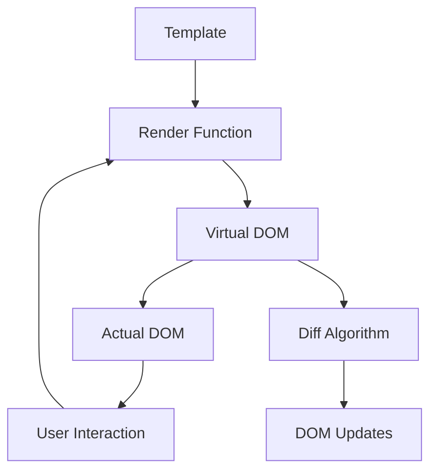

# Vue.js 响应式原理
---
##### Vue 实例与数据响应
```javascript
var vm = new Vue({
    el: '#app',
    data: {
        title: '商品列表',
        goods: [
            { name: '商品1', price: 100, chosen: true },
            { name: '商品2', price: 200, chosen: false }
        ]
    },
    computed: {
        total: function() {
            var sum = 0;
            for (var i = 0; i < this.goods.length; i++) {
                if (this.goods[i].chosen) {
                    sum += this.goods[i].price;
                }
            }
            return sum;
        }
    }
});
```

##### 响应式数据实现原理
[修正代码]：
```javascript
function observe(obj) {
    for (const key in obj) {
        let internalValue = obj[key];
        const dep = new Dep(); // 依赖收集器
        
        Object.defineProperty(obj, key, {
            get: function() {
                // 收集当前依赖
                dep.depend();
                return internalValue;
            },
            set: function(newVal) {
                internalValue = newVal;
                // 通知所有依赖更新
                dep.notify();
            }
        });
    }
}

// 依赖收集器
class Dep {
    constructor() {
        this.subscribers = new Set();
    }
    
    depend() {
        if (activeEffect) {
            this.subscribers.add(activeEffect);
        }
    }
    
    notify() {
        this.subscribers.forEach(effect => effect());
    }
}

let activeEffect = null;

function watchEffect(effect) {
    activeEffect = effect;
    effect();
    activeEffect = null;
}
```

##### 响应式系统工作流程
[补充说明]：
1. **数据劫持**：通过Object.defineProperty或Proxy拦截数据访问
2. **依赖收集**：在getter中收集使用该数据的函数（依赖）
3. **派发更新**：在setter中通知所有依赖进行更新
4. **批量更新**：避免频繁更新，使用异步队列优化性能

---

# Vue 响应式原理与虚拟 DOM
---

##### Reactivity 系统本质
[补充说明]：Vue 的响应式本质上是一个观察者模式实现
```javascript
// Reactivity 核心原理
function reactive(obj) {
    return new Proxy(obj, {
        get(target, key) {
            track(target, key); // 追踪依赖
            return target[key];
        },
        set(target, key, value) {
            target[key] = value;
            trigger(target, key); // 触发更新
            return true;
        }
    });
}

// 依赖追踪系统
let activeEffect = null;

function watchEffect(effect) {
    activeEffect = effect;
    effect();
    activeEffect = null;
}

function track(target, key) {
    if (activeEffect) {
        // 建立 target.key 与 effect 的映射关系
    }
}

function trigger(target, key) {
    // 找到所有依赖 target.key 的 effect 并执行
}
```

##### 渲染流程解析
[修正说明]：Vue 的模板编译和渲染完整流程



[补充说明]：
- **Template**：Vue 的模板语法
- **Render Function**：编译后的渲染函数
- **Virtual DOM**：轻量级的 JavaScript 对象，描述真实 DOM
- **Diff Algorithm**：比较新旧虚拟 DOM，计算最小更新
- **DOM Updates**：应用更新到真实 DOM


##### 模板编译器探索
[补充说明]：Vue 模板编译过程
```javascript
// 模板代码
const template = `<div class="container">{{ message }}</div>`;

// 编译后的渲染函数
const renderFunction = function() {
    return h('div', { class: 'container' }, this.message);
};

// Vue 3 的编译优化
const optimizedRender = function() {
    return {
        type: 'div',
        props: { class: 'container' },
        children: this.message,
        patchFlag: 1 // 标识动态内容
    };
};
```

##### 性能优势对比
[补充说明]：Vue 3 相比 Vue 2 的性能提升
- **打包体积**：减少约 41%
- **初始渲染**：提速约 55%
- **更新性能**：提速约 133%
- **内存占用**：减少约 54%

##### 迁移建议
[补充说明]：从 Vue 2 迁移到 Vue 3 的注意事项
1. 使用官方迁移工具：`vue-compat` 构建
2. 逐步替换选项式 API 为组合式 API
3. 更新生命周期函数名称
4. 检查第三方库的 Vue 3 兼容性

---