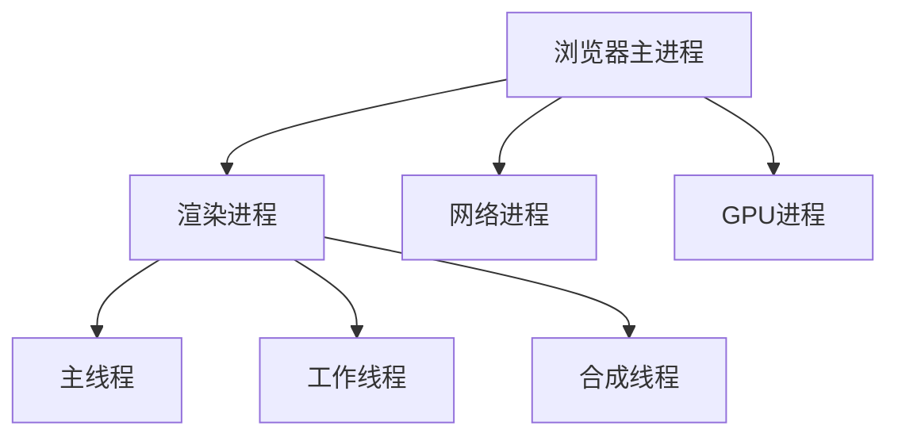

##### 浏览器进程架构
---
[补充说明]：现代浏览器采用多进程架构，提高稳定性和安全性



[修正说明]：
- **浏览器主进程**：负责界面显示、用户交互、子进程管理
- **渲染进程**：每个标签页独立进程，包含主线程、工作线程等
	- ==渲染主线程==：事件循环发生在此处
- **网络进程**：负责网络资源加载
- **GPU进程**：负责图形渲染和合成
# 事件循环
---
由于用户交互的特性，js==只能是单线程的==
![[Pasted image 20250830153057.png]]

但这产生了一些问题：
![[Pasted image 20250830153139.png]]


![[Pasted image 20250830153415.png]]

![[Pasted image 20250830153745.png]]

异步的代码：
- 计时任务：setTimeout
- 网络任务：XHR、Fetch
- 用户操作：addEventListener

![[Pasted image 20250830154310.png]]
2与3将循环的执行，反复的查找任务队列，这个过程就是**事件循环eventloop**
展开来说：渲染主线程会不断的检查任务队列中的任务，任务存在就取出一个，执行。没有任务就休眠，直到有新的任务进入队列。


![[Pasted image 20250830154551.png]]
这里的==宿主环境==也就是其他的线程，比如计时器任务会==调用OS中的接口==。当宿主环境的任务的执行时机到了（比如计时器时间到了，就会将回调函数包装为任务，加入对应的队列尾部。

js中的定时器必然不是精确的：
- 浏览器使用的宿主环境（OS的接口所提供的时间，本身就是不精确的
- setTimeout函数在5个嵌套时，每个setTimeout至少有4ms的延迟
- 宿主环境将任务加入计时队列后，若有其他优先级更高的队列不为空，也不会立刻执行
不过这些误差并不会极大地影响用户的使用体验

##### 宏任务与微任务（已过时
---
![[Pasted image 20250830154841.png]]
异步任务：
- 宏任务：
- 微任务：

执行顺序：同步、微任务、宏任务
![[Pasted image 20250830155048.png]]
这种说法已经过时
W3C的说法是：
- 微队列    ：最高优先级
- 交互队列：高优先级
- 延时队列：中优先级
至少包含这三种Message队列

##### 任务队列优先级
---
[修正说明]：浏览器任务队列按优先级排序

| 队列类型 | 优先级 | 包含任务 | 执行时机 |
|---------|--------|----------|----------|
| **微任务队列** | 最高 | Promise回调、MutationObserver | 每个宏任务结束后立即执行 |
| **交互队列** | 高 | 用户交互事件（点击、输入等） | 优先于其他宏任务 |
| **延迟队列** | 中 | setTimeout、setInterval | 定时到达后执行 |
| **普通队列** | 低 | 网络请求、I/O操作 | 按到达顺序执行 |

##### 渲染阻塞与优化策略
---
[补充说明]：
1. **长任务拆分**：将耗时任务分解为小任务
```javascript
// 不好的做法：长任务阻塞渲染
function processLargeData() {
    // 耗时操作...
}

// 好的做法：任务拆分
function processInChunks() {
    const chunk = data.splice(0, 100);
    processChunk(chunk);
    
    if (data.length > 0) {
        // 使用setTimeout或requestIdleCallback让出主线程
        setTimeout(processInChunks, 0);
    }
}
```

2. **使用Web Workers**：将计算密集型任务移出主线程
```javascript
// 主线程
const worker = new Worker('task.js');
worker.postMessage(data);
worker.onmessage = function(event) {
    // 处理结果
};

// Worker线程（task.js）
self.onmessage = function(event) {
    const result = heavyComputation(event.data);
    self.postMessage(result);
};
```

##### 性能监控实践
---
[补充说明]：监控长任务和渲染性能
```javascript
// 监控长任务（超过50ms的任务）
const observer = new PerformanceObserver((list) => {
    for (const entry of list.getEntries()) {
        if (entry.duration > 50) {
            console.warn('长任务 detected:', entry);
        }
    }
});
observer.observe({entryTypes: ['longtask']});

// 监控帧率
let frameCount = 0;
let lastTime = performance.now();
function checkFPS() {
    frameCount++;
    const currentTime = performance.now();
    if (currentTime - lastTime >= 1000) {
        const fps = Math.round((frameCount * 1000) / (currentTime - lastTime));
        console.log('当前FPS:', fps);
        frameCount = 0;
        lastTime = currentTime;
    }
    requestAnimationFrame(checkFPS);
}
checkFPS();
```

##### 面试题
---
![[Pasted image 20250830155930.png]]
执行顺序：（我猜 321 312
我去，第一次对了，我改什么...

正确答案：321

![[Pasted image 20250830160213.png]]
我的：11,14,12,15,13答案正确

![[Pasted image 20250830160817.png]]
答案2,3,6,p2,p1,1,4,5

![[Pasted image 20250830161443.png]]
 答案：script start，async1 start，async2 ，async1 end，setTimeout

```javascript
setTimeout(() => console.log(0));
new Promise((resolve) => {
  console.log(1);
  resolve(2);
  console.log(3);
}).then((o) => console.log(o));
 
new Promise((resolve) => {
  console.log(4);
  resolve(5);
})
  .then((o) => console.log(o))
  .then(() => console.log(6));
```
1,3,4,2,5,6,0