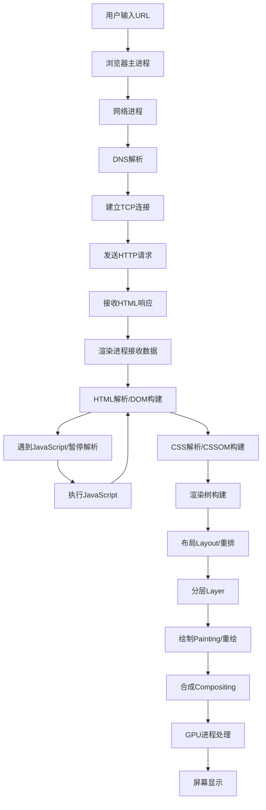
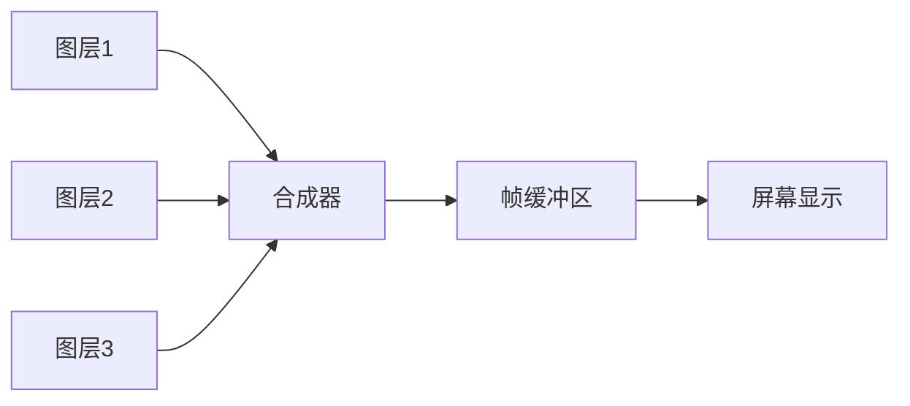

# 浏览器渲染原理与进程架构
---
##### 浏览器多进程架构
现代浏览器采用多进程架构，主要包含以下核心进程：
- **浏览器主进程 (Browser Process)**：负责界面显示、用户交互、子进程管理
- **渲染进程 (Renderer Process)**：位于沙盒之中，负责页面渲染、脚本执行（每个==标签页==都是独立的进程）
	- 渲染主线程
	- 合成线程
	- 栅格线程等
- **GPU进程 (GPU Process)**：负责图形渲染、3D绘制等GPU相关任务
- **网络进程 (Network Process)**：负责所有网络资源请求和管理

![[Pasted image 20250903155953.png]]

多进程架构的优势包括：
- 隔离性：单个标签页崩溃不影响其他页面
- 安全性：渲染进程在沙盒中与操作系统隔离开来
- 性能优化

##### 渲染时机
渲染进程在==文档加载==、样式==变化==、用户==交互==时触发

##### 从输入地址到渲染出页面的过程


网络请求部分
1. **DNS解析**：将域名转换为IP地址
2. **TCP连接**：与服务器建立可靠连接（三次握手）
3. **HTTP请求**：发送请求头和数据
4. **响应处理**：接收服务器返回的HTML、CSS、JS等资源
5. **数据传输**：将响应数据传递给渲染进程进行解析
6. **预解析器**：提前下载CSS和JavaScript资源
##### DOM树与CSSOM树
HTML解析：
- **令牌化 (Tokenization)**：将HTML标签转换为令牌
- **树构建**：根据标签嵌套关系构建DOM树
- **预解析优化**：主解析器工作时，预解析器提前扫描和下载外部资源

CSS解析与HTML解析并行进行

JavaScript对渲染流程的影响：
```html
<!-- 同步脚本阻塞解析 -->
<script src="app.js"></script>
<!-- 异步脚本不阻塞 -->
<script async src="app.js"></script>
<!-- 延迟执行脚本 -->
<script defer src="app.js"></script>
```
阻塞机制：
- **解析阻塞**：同步脚本会暂停HTML解析
- **渲染阻塞**：CSS和JavaScript都可能阻塞渲染，CSS不会阻塞HTML解析，但会阻塞页面渲染

##### 渲染树
结合DOM和CSSOM生成渲染树：
- **仅包含可见元素**：`display: none`的元素不进入渲染树
- **样式计算**：为每个元素计算最终样式（层叠、继承）
- **可见性处理**：`visibility: hidden`的元素仍在渲染树中但不可见
##### 布局Layout（重排）流程
- **布局计算**：计算每个元素在视口中的精确位置和大小（重排）
- **重排触发**：当布局变化时需要重新计算元素几何属性

1. **计算位置大小**：确定元素在视口中的确切位置和尺寸
2. **重排影响**：布局变化会导致整个渲染流程重新执行

##### 分层Layer
浏览器将页面分解为多个图层进行优化渲染：
- **显式分层**：`transform`, `opacity`, `will-change`等CSS属性
- **隐式分层**：重叠内容、视频、canvas等特殊元素
- **硬件加速**：使用GPU进行图层合成，提升性能
- **层管理**：浏览器自动管理图层创建和销毁

##### 绘制Paint（重绘）
将渲染树转换为屏幕像素的过程：
1. **绘制列表生成**：为每个图层生成绘制命令
2. **重绘触发**：当元素外观变化但不影响布局时发生
3. **绘制优化**：仅重新绘制受影响区域

##### 光栅化raster
分块tiles：
- **图块划分**：将大图层分割为小图块（通常256x256或512x512）
- **视口优先**：优先渲染可视区域内的图块
- **渐进加载**：离视口越远的图块优先级越低
- **缓存机制**：已光栅化的图块会被缓存复用

光栅化：将矢量图形转换为位图
1. 合成器将图层分为图块
2. 光栅线程将图块转换为位图
3. GPU进程合成最终图像

##### 合成
合成器线程将各个图层合成为最终图像frame：


[合成优势]：
- **独立合成**：图层变化无需重新布局和绘制
- **GPU加速**：利用显卡硬件能力提升性能
- **60fps目标**：每16.67ms完成一次完整的渲染流水线

##### 绘制draw
![[Pasted image 20250922222036.png]]

[性能优化建议]：
1. **减少重排reflow**：批量DOM操作，使用文档片段，尽量减少节点的几何信息、DOM结构、宽高、字体大小的频繁修改
2. **优化重绘repaint**：使用CSS类名切换而非直接样式修改
3. **利用合成层**：对动画元素使用transform和opacity
4. **避免布局抖动**：不要在循环中连续读取布局属性
5. **减少图层数量**：避免不必要的图层创建，防止"层爆炸"

##### 现代渲染引擎优化特性
[补充说明]：现代浏览器还包含以下优化机制：
- **增量布局**：只重新计算变化部分的布局
- **懒加载**：延迟加载视口外的图片和内容
- **预渲染**：预测用户行为提前渲染可能访问的页面
- **缓存机制**：复用已光栅化的图块和计算结果
- **并行处理**：多个渲染阶段可以并行执行提升效率

---